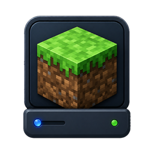

# ServerKit Minecraft

<p>
  
</p>

[](https://serverkit.ai/i/ext/serverkit-minecraft)

Run a Minecraft server for your friends in a few clicks — a first-party
[ServerKit](https://github.com/jhd3197/ServerKit) extension. Java (Vanilla /
Paper / Fabric / Forge) and Bedrock editions, on the standard
[itzg/minecraft-server](https://docker.minecraft-server.biz) community images.

- **One-screen create wizard** — edition, flavor, version, world name + seed,
  memory, port (availability-checked), explicit EULA checkbox (never
  pre-accepted). Creation rides ServerKit's Deploy Console, so you watch the
  image pull and world generation live.
- **Overview** — status, uptime, players online, memory/CPU tiles, next
  scheduled restart, and a "Share with friends" card with the connect address
  and per-edition client instructions.
- **Console** — live log tail plus an RCON command box with history and
  common-command chips (Java; Bedrock has no RCON and degrades to log-only).
- **Players** — online list with kick/ban/op, whitelist manager, ops and ban
  lists (RCON-backed, Java only).
- **Settings** — `server.properties` rendered as a grouped form with labels,
  descriptions and restart-required badges; saving flags when a restart is
  needed and offers to do it gracefully.
- **Backups** — the correct hot-backup sequence (`save-off` →
  `save-all flush` → copy-then-zip → `save-on`), retention count,
  skip-when-empty, and stop-first restore.
- **Schedules** — restart (with in-game countdown broadcast), announcement
  and backup schedules on ServerKit's cron rails.
- **Notifications** — player join/leave, server started, crash (distinguished
  from a user stop), and backup success/failure through ServerKit's
  notification bus.

## Install

[**Install in ServerKit →**](https://serverkit.ai/i/ext/serverkit-minecraft)

Name your panel once and that link opens it straight to the install
confirmation; it is remembered in your browser, so every later install is a
single click. Your panel does the installing — serverkit.ai never connects to
it, and the panel's own consent and signature checks still run.

From inside the panel instead:

- **Extensions page:** ServerKit → Extensions → find "Minecraft Server" →
  Install.
- **GitHub URL / zip:** Extensions → *Install manually* → install from
  `https://github.com/jhd3197/serverkit-minecraft` or upload the release zip.

Requires ServerKit ≥ 1.7.0 with Docker. Game ports publish directly (25565/TCP
Java, 19132/UDP Bedrock) with firewall rules managed by the panel; RCON binds
to loopback only and is never exposed.

## Development

```
backend/     Flask blueprint + services + gamekit (RCON client, log-event
             parser, config-form, save-aware backup, compose generation)
frontend/    runtime-ESM bundle source (react / react-router-dom /
             serverkit-sdk are external; CSS inlined into dist/index.mjs)
tests/       pytest suite — runs inside a ServerKit checkout (see tests/README.md)
scripts/     release-zip + registry tooling (see RELEASING flow)
```

Build the frontend bundle:

```bash
cd frontend
npm install
npm run build        # → dist/index.mjs
```

Build the installable zip:

```bash
./scripts/build-zip.sh        # or scripts/build-zip.ps1 on Windows
```

## Tests

The tests need the panel's Flask app + pytest fixtures, so they run from
inside a ServerKit checkout via symlink — see [tests/README.md](tests/README.md).

## Credits

- [itzg/minecraft-server](https://github.com/itzg/docker-minecraft-server) and
  [itzg/minecraft-bedrock-server](https://github.com/itzg/docker-minecraft-bedrock-server)
  — the standard community images this extension configures through their
  documented env surface (never forked).
- Minecraft is a trademark of Microsoft/Mojang. This extension is not
  affiliated with or endorsed by them. Running a server requires accepting
  the [Minecraft EULA](https://aka.ms/MinecraftEULA) — the wizard asks you,
  we never accept it for you.

## License

MIT — see [LICENSE](LICENSE).
